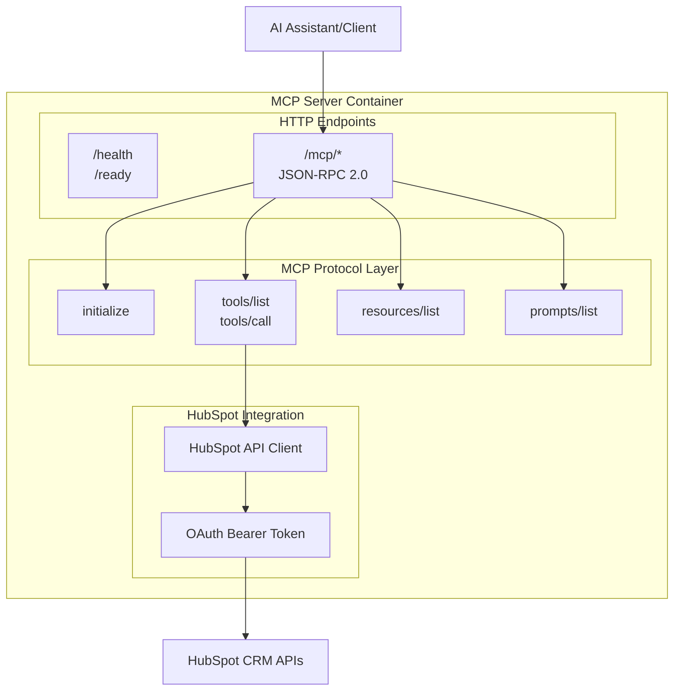

# 🔌 HubSpot MCP Server - Protocol Reference

## Overview

This HubSpot MCP Server implements the **Model Context Protocol (MCP)** over HTTP, providing standardized access to HubSpot CRM data through JSON-RPC 2.0 endpoints. The server enables AI assistants and external applications to interact with HubSpot contacts, companies, and deals data.

## 🏗️ Architecture



## 🚀 Quick Start

### 1. Run the Container

```bash
docker run -d \
  --name hubspot-mcp-server \
  -p 3000:3000 \
  -e HUBSPOT_PRIVATE_APP_ACCESS_TOKEN=your_token_here \
  hubspot-mcp-server:latest
```

### 2. Test MCP Endpoints

```bash
# Check server health
curl http://localhost:3000/health

# Initialize MCP session
curl -X POST http://localhost:3000/mcp/initialize \
  -H "Content-Type: application/json" \
  -d '{
    "jsonrpc": "2.0",
    "id": 1,
    "method": "initialize",
    "params": {}
  }'
```

## 📋 MCP Protocol Endpoints

### Base URL
```
http://localhost:3000
```

### JSON-RPC 2.0 Format
All MCP requests follow JSON-RPC 2.0 specification:

```json
{
  "jsonrpc": "2.0",
  "id": "unique_request_id",
  "method": "mcp_method_name",
  "params": {
    // method-specific parameters
  }
}
```

---

## 🔧 Core MCP Methods

### 1. initialize
**Purpose**: Initialize MCP session and get server capabilities

**Endpoint**: `POST /mcp/initialize`

**Request**:
```json
{
  "jsonrpc": "2.0",
  "id": 1,
  "method": "initialize",
  "params": {
    "protocolVersion": "2024-11-05",
    "capabilities": {},
    "clientInfo": {
      "name": "your-client",
      "version": "1.0.0"
    }
  }
}
```

**Response**:
```json
{
  "jsonrpc": "2.0",
  "id": 1,
  "result": {
    "protocolVersion": "2024-11-05",
    "capabilities": {
      "tools": { "listChanged": true },
      "resources": { "listChanged": true },
      "prompts": { "listChanged": true }
    },
    "serverInfo": {
      "name": "hubspot-mcp-server",
      "version": "1.0.0"
    },
    "instructions": "HubSpot MCP Server - Access to CRM contacts, companies, and deals data"
  }
}
```

---

### 2. tools/list
**Purpose**: Get list of available tools

**Endpoint**: `POST /mcp/tools/list`

**Request**:
```json
{
  "jsonrpc": "2.0",
  "id": 2,
  "method": "tools/list",
  "params": {}
}
```

**Response**:
```json
{
  "jsonrpc": "2.0",
  "id": 2,
  "result": {
    "tools": [
      {
        "name": "get_contacts",
        "description": "Retrieve HubSpot contacts with optional filtering",
        "inputSchema": {
          "type": "object",
          "properties": {
            "limit": {
              "type": "number",
              "description": "Maximum number of contacts to retrieve",
              "default": 10
            },
            "properties": {
              "type": "array",
              "items": { "type": "string" },
              "description": "Contact properties to include"
            }
          }
        }
      },
      {
        "name": "get_companies",
        "description": "Retrieve HubSpot companies with optional filtering",
        "inputSchema": {
          "type": "object",
          "properties": {
            "limit": {
              "type": "number",
              "description": "Maximum number of companies to retrieve",
              "default": 10
            },
            "properties": {
              "type": "array",
              "items": { "type": "string" },
              "description": "Company properties to include"
            }
          }
        }
      },
      {
        "name": "get_deals",
        "description": "Retrieve HubSpot deals with optional filtering",
        "inputSchema": {
          "type": "object",
          "properties": {
            "limit": {
              "type": "number",
              "description": "Maximum number of deals to retrieve",
              "default": 10
            },
            "properties": {
              "type": "array",
              "items": { "type": "string" },
              "description": "Deal properties to include"
            }
          }
        }
      },
      {
        "name": "create_contact",
        "description": "Create a new contact in HubSpot",
        "inputSchema": {
          "type": "object",
          "properties": {
            "firstname": { "type": "string", "description": "Contact first name" },
            "lastname": { "type": "string", "description": "Contact last name" },
            "email": { "type": "string", "description": "Contact email address" },
            "company": { "type": "string", "description": "Contact company name" }
          },
          "required": ["email"]
        }
      },
      {
        "name": "search_contacts",
        "description": "Search HubSpot contacts by query",
        "inputSchema": {
          "type": "object",
          "properties": {
            "query": { "type": "string", "description": "Search query string" },
            "properties": {
              "type": "array",
              "items": { "type": "string" },
              "description": "Contact properties to include"
            }
          },
          "required": ["query"]
        }
      }
    ]
  }
}
```

---

### 3. tools/call
**Purpose**: Execute a specific tool

**Endpoint**: `POST /mcp/tools/call`

**Request Example - Get Contacts**:
```json
{
  "jsonrpc": "2.0",
  "id": 3,
  "method": "tools/call",
  "params": {
    "name": "get_contacts",
    "arguments": {
      "limit": 5,
      "properties": ["firstname", "lastname", "email", "company"]
    }
  }
}
```

**Request Example - Create Contact**:
```json
{
  "jsonrpc": "2.0",
  "id": 4,
  "method": "tools/call",
  "params": {
    "name": "create_contact",
    "arguments": {
      "firstname": "John",
      "lastname": "Doe",
      "email": "john.doe@example.com",
      "company": "Example Corp"
    }
  }
}
```

**Response**:
```json
{
  "jsonrpc": "2.0",
  "id": 3,
  "result": {
    "content": [
      {
        "type": "text",
        "text": "{\n  \"results\": [\n    {\n      \"id\": \"12345\",\n      \"properties\": {\n        \"firstname\": \"John\",\n        \"lastname\": \"Doe\",\n        \"email\": \"john.doe@example.com\",\n        \"company\": \"Example Corp\"\n      }\n    }\n  ]\n}"
      }
    ]
  }
}
```

---

### 4. resources/list
**Purpose**: Get list of available resources

**Endpoint**: `POST /mcp/resources/list`

**Request**:
```json
{
  "jsonrpc": "2.0",
  "id": 5,
  "method": "resources/list",
  "params": {}
}
```

**Response**:
```json
{
  "jsonrpc": "2.0",
  "id": 5,
  "result": {
    "resources": [
      {
        "uri": "hubspot://contacts",
        "name": "HubSpot Contacts",
        "description": "Access to HubSpot CRM contacts database",
        "mimeType": "application/json"
      },
      {
        "uri": "hubspot://companies",
        "name": "HubSpot Companies",
        "description": "Access to HubSpot CRM companies database",
        "mimeType": "application/json"
      },
      {
        "uri": "hubspot://deals",
        "name": "HubSpot Deals",
        "description": "Access to HubSpot CRM deals database",
        "mimeType": "application/json"
      }
    ]
  }
}
```

---

### 5. prompts/list
**Purpose**: Get list of available prompts

**Endpoint**: `POST /mcp/prompts/list`

**Request**:
```json
{
  "jsonrpc": "2.0",
  "id": 6,
  "method": "prompts/list",
  "params": {}
}
```

**Response**:
```json
{
  "jsonrpc": "2.0",
  "id": 6,
  "result": {
    "prompts": [
      {
        "name": "analyze_contacts",
        "description": "Analyze contact data for insights and patterns",
        "arguments": [
          {
            "name": "criteria",
            "description": "Analysis criteria (e.g., activity, demographics)",
            "required": false
          }
        ]
      },
      {
        "name": "company_research",
        "description": "Research companies and their contact information",
        "arguments": [
          {
            "name": "industry",
            "description": "Target industry for research",
            "required": false
          }
        ]
      }
    ]
  }
}
```

---

## 🏥 Health Endpoints

### GET /health
**Purpose**: Container health check (liveness probe)

```bash
curl http://localhost:3000/health
```

**Response**:
```json
{
  "status": "healthy",
  "timestamp": "2024-01-15T10:30:00.000Z",
  "uptime": 3600,
  "version": "1.0.0",
  "service": "hubspot-mcp-server"
}
```

### GET /ready
**Purpose**: Container readiness check (readiness probe)

```bash
curl http://localhost:3000/ready
```

**Response**:
```json
{
  "status": "ready",
  "timestamp": "2024-01-15T10:30:00.000Z",
  "checks": {
    "hubspot_token": true,
    "server": "running"
  }
}
```

---

## 🚨 Error Handling

### JSON-RPC Error Response Format
```json
{
  "jsonrpc": "2.0",
  "id": "request_id",
  "error": {
    "code": -32603,
    "message": "Internal error message"
  }
}
```

### Common Error Codes
| Code | Meaning | Description |
|------|---------|-------------|
| `-32700` | Parse error | Invalid JSON was received |
| `-32600` | Invalid Request | The JSON sent is not a valid Request object |
| `-32601` | Method not found | The method does not exist |
| `-32602` | Invalid params | Invalid method parameter(s) |
| `-32603` | Internal error | Internal JSON-RPC error |

---

## 🔐 Authentication

All HubSpot API requests are automatically authenticated using the `HUBSPOT_PRIVATE_APP_ACCESS_TOKEN` environment variable. No additional authentication is required for MCP protocol calls.

### Required HubSpot Scopes
- `crm.objects.contacts.read`
- `crm.objects.contacts.write`
- `crm.objects.companies.read`
- `crm.objects.deals.read`

---

## 🛠️ Integration Examples

### JavaScript/Node.js Client
```javascript
class MCPClient {
  constructor(baseUrl = 'http://localhost:3000') {
    this.baseUrl = baseUrl;
    this.requestId = 1;
  }

  async call(method, params = {}) {
    const response = await fetch(`${this.baseUrl}/mcp/${method.replace('/', '/')}`, {
      method: 'POST',
      headers: { 'Content-Type': 'application/json' },
      body: JSON.stringify({
        jsonrpc: '2.0',
        id: this.requestId++,
        method,
        params
      })
    });

    const data = await response.json();
    
    if (data.error) {
      throw new Error(`MCP Error: ${data.error.message}`);
    }
    
    return data.result;
  }

  async initialize() {
    return this.call('initialize');
  }

  async listTools() {
    return this.call('tools/list');
  }

  async callTool(name, arguments = {}) {
    return this.call('tools/call', { name, arguments });
  }
}

// Usage
const client = new MCPClient();
await client.initialize();
const tools = await client.listTools();
const contacts = await client.callTool('get_contacts', { limit: 5 });
```

### Python Client
```python
import requests
import json

class MCPClient:
    def __init__(self, base_url='http://localhost:3000'):
        self.base_url = base_url
        self.request_id = 1
        self.session = requests.Session()
        self.session.headers.update({'Content-Type': 'application/json'})
    
    def call(self, method, params=None):
        if params is None:
            params = {}
            
        endpoint = f"{self.base_url}/mcp/{method.replace('/', '/')}"
        
        payload = {
            'jsonrpc': '2.0',
            'id': self.request_id,
            'method': method,
            'params': params
        }
        
        self.request_id += 1
        
        response = self.session.post(endpoint, json=payload)
        response.raise_for_status()
        
        data = response.json()
        
        if 'error' in data:
            raise Exception(f"MCP Error: {data['error']['message']}")
        
        return data['result']
    
    def initialize(self):
        return self.call('initialize')
    
    def list_tools(self):
        return self.call('tools/list')
    
    def call_tool(self, name, arguments=None):
        if arguments is None:
            arguments = {}
        return self.call('tools/call', {'name': name, 'arguments': arguments})

# Usage
client = MCPClient()
client.initialize()
tools = client.list_tools()
contacts = client.call_tool('get_contacts', {'limit': 5})
```

---

## 🔧 Configuration

### Environment Variables

| Variable | Required | Default | Description |
|----------|----------|---------|-------------|
| `HUBSPOT_PRIVATE_APP_ACCESS_TOKEN` | **Yes** | - | HubSpot Private App access token |
| `PORT` | No | `3000` | HTTP server port |
| `HOST` | No | `0.0.0.0` | Server host binding |
| `NODE_ENV` | No | `production` | Runtime environment |
| `HUBSPOT_API_URL` | No | `https://api.hubapi.com` | HubSpot API base URL |
| `CORS_ORIGIN` | No | `localhost` | CORS allowed origins |
| `MAX_REQUEST_SIZE` | No | `10485760` | Max request size (bytes) |
| `GRACEFUL_SHUTDOWN_TIMEOUT` | No | `10000` | Shutdown timeout (ms) |

---

## 🐛 Troubleshooting

### Common Issues

**MCP calls return authentication errors**:
- Verify `HUBSPOT_PRIVATE_APP_ACCESS_TOKEN` is correctly set
- Check token has required scopes in HubSpot Private App settings

**Server not responding**:
```bash
# Check server status
curl http://localhost:3000/health

# Check container logs
docker logs hubspot-mcp-server
```

**CORS errors in browser**:
- Set `CORS_ORIGIN` environment variable to your domain
- For development, use `CORS_ORIGIN=*` (not recommended for production)

This MCP Protocol Guide provides complete reference documentation for integrating with the HubSpot MCP Server following JSON-RPC 2.0 and MCP protocol standards.
